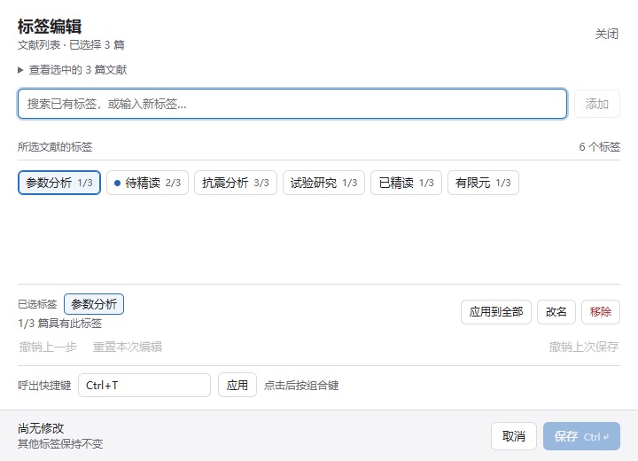

# Zotero Tag Editor


用一个快捷键编辑一篇或多篇文献的标签，支持批量添加、移除和改名，保留未操作的标签。

## 安装

从 [最新 Release](https://github.com/lllaterOn/zotero-tag-editor/releases/latest) 下载 `.xpi`。在 Zotero 的“工具 → 插件”窗口中，通过齿轮菜单选择“从文件安装插件”，选中该文件。

面向 Windows 上的 Zotero 10，最低版本 10.0.3；已在 Zotero 10.0.3 验证，其他系统尚未验收。正式版通过仓库的 updates.json 自动更新。0.1.x 本地试用版用户需手动安装一次正式版，之后才能使用正式更新地址。

## 使用

1. 在文献列表选中一篇或多篇文献，按 **Ctrl+T**，或点击“工具 → 标签编辑器…”。在 PDF 阅读器中呼出时，操作 PDF 所属文献。
2. 输入标签名称，选择已有标签或创建新标签，按 Enter 添加。方向键选择候选，Esc 收起候选浮层。
3. 点击标签块，再使用“应用到全部”“改名”或“移除”。`n/N` 表示所选文献中多少篇具有该标签。
4. 点击“保存”或按 **Ctrl+Enter**，统一写入修改；此前所有操作都是草稿。



上图使用模拟文献展示实际编辑器界面。

“已选标签”明确显示操作对象。标签区独立滚动，搜索与保存位置保持稳定。底部可以修改快捷键：点击输入框，按组合键，再点“应用”。若 Ctrl+T 被其他插件占用，可从工具菜单打开后更换组合键。

更换 Zotero 选择后再次按 Ctrl+T，会重新载入新目标；有未保存的标签修改时先询问是否放弃，取消则保留原草稿及目标。

## 编辑规则

- 添加只补齐缺少该标签的条目；移除只影响所选条目；改名只处理具有源标签的条目，遇到同名目标自动合并。
- 不执行全库改名，不编辑附件、笔记或批注自身的标签。新增及主动改名的标签是手动标签，其他自动标签保留原类型。
- 撤销上一步、重置本次编辑作用于草稿。撤销上次保存恢复本次 Zotero 运行期间最近一次保存，按那次实际修改的条目执行，重启后不保留。
- 保存与撤销检查标签是否被其他操作改变。冲突时保留状态并提示处理，避免覆盖后续修改；保存使用事务执行。

## 开发与维护

使用 Node.js 22 或更高版本：

```sh
npm ci
npm run verify
```

构建输出在 dist/，源码位于 src/，窗口、图标与元数据位于 addon/。维护遵循功能分支 → PR → CI → Draft 验证 → 正式发布，见 [开发与发布](docs/DEVELOPMENT.md)、[v1.0.0 验收记录](docs/ACCEPTANCE-1.0.0.md) 和 [更新日志](CHANGELOG.md)。

反馈请提交 [Issue](https://github.com/lllaterOn/zotero-tag-editor/issues)，注明 Zotero 版本、插件版本和复现步骤，不上传私人文献或凭证。安全问题见 [SECURITY.md](SECURITY.md)。

维护方式与图标风格参考作者的 [Focus Columns](https://github.com/lllaterOn/zotero-focus-columns)、[Bilingual Outline](https://github.com/lllaterOn/zotero-bilingual-outline) 和 [Comment Expand](https://github.com/lllaterOn/zotero-comment-expand)。MIT License，Copyright © 2026 lllaterOn。
